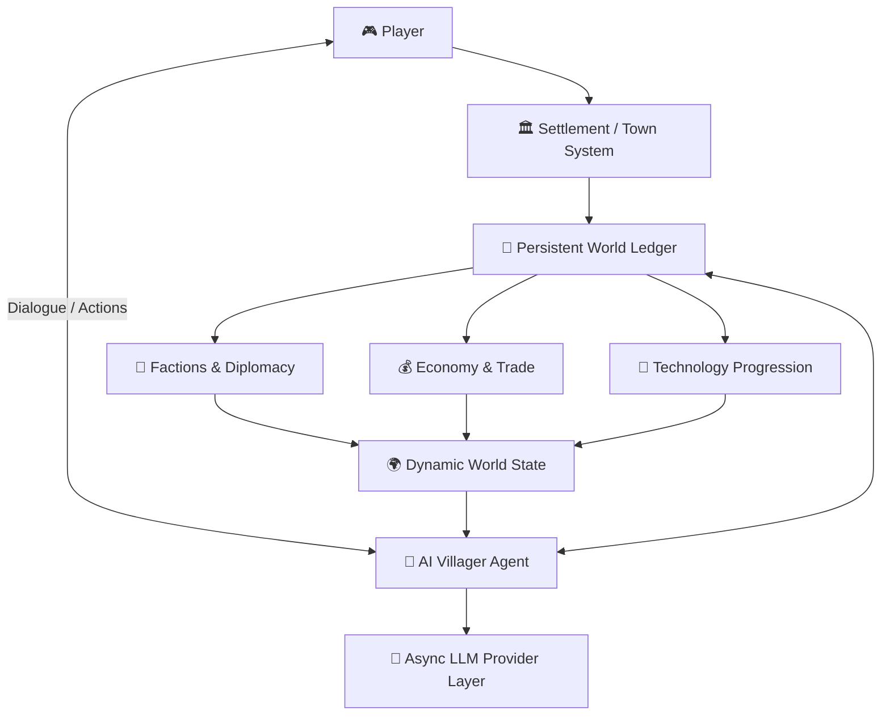

<div align="center">

# 🏛️ CivilCraft AI

### Minecraft 4X Nation-Building Mod, Autonomous LLM Villagers & Dynamic Geopolitical Simulation

**CivilCraft AI** is a Minecraft Fabric 1.21 mod concept that brings first-person 4X strategy into a voxel survival world. Players establish settlements, manage territory and resources, progress through technology eras, and interact with autonomous AI villagers, leaders, traders, and soldiers designed to remember relationships and make geopolitical decisions.

<p align="center">
  
  
  
  
  
</p>

</div>

---

## 🌌 Core Vision

CivilCraft combines Minecraft survival and building with strategic systems inspired by 4X games. AI citizens are designed to do more than provide scripted dialogue: the project vision includes agents that can build, farm, trade, plan, negotiate, remember player actions, establish treaties, and react to an evolving political world.

## 🏛️ Gameplay Systems

| System | Planned Behavior |
|---|---|
| 🏘️ Settlements | Place a Town Hall to establish a settlement and expand chunk-based claims |
| 🤖 AI Citizens | Personality-driven villagers with roles, dialogue and long-term memory |
| 🤝 Diplomacy | Factions, alliances, hostile states, treaties and war mechanics |
| 💰 Economy | Copper/silver/gold currency, town ledgers, markets and merchant caravans |
| ⛏️ Resources | Strategic nodes tied to expansion and progression |
| 🔬 Technology | Research points and era progression from early survival to Redstone/Steam systems |

## 🧠 Agent & World Architecture



> [!IMPORTANT]
> The project requirements specify that LLM calls, database work and heavy pathfinding should not block Minecraft's main game thread. The planned provider layer is configurable for services such as Ollama, OpenAI, Gemini or Vertex AI.

## 🚀 Development Setup

```bash
git clone --branch 1.21 https://github.com/shreeharsh-patil/CivilCraft--Minecraft-Mod.git
cd CivilCraft--Minecraft-Mod
```

### Run a development client

```bash
./gradlew runClient
```

Windows:

```powershell
.\gradlew.bat runClient
```

### Build the mod

```bash
./gradlew build
```

Generated artifacts are placed under `build/libs/` by the Gradle/Fabric toolchain.

## 📁 Repository Structure

```text
CivilCraft--Minecraft-Mod/
├─ src/                    # Fabric mod source and resources
├─ gradle/                 # Gradle wrapper files
├─ build.gradle            # Fabric Loom build configuration
├─ gradle.properties       # Minecraft, Loader, API and mod versions
├─ settings.gradle         # Gradle project settings
├─ coreidea.md             # Core vision and gameplay pillars
├─ prd.md                  # Product requirements and system behavior
├─ LICENSE                 # Repository license
└─ README.md               # Project documentation
```

## 🗺️ Development Direction

The current project documents define the intended foundation: settlement claiming, autonomous agents, persistent memory, faction diplomacy, an economy ledger, merchant routes, and a technology tree. Implementation can be expanded incrementally while keeping server performance and configurability as first-class constraints.

## 👤 Project Maintainer

Maintained by **Shreeharsh Patil**.

- **Email:** shreeharsh.dev@gmail.com
- **GitHub:** [github.com/shreeharsh-patil](https://github.com/shreeharsh-patil)
